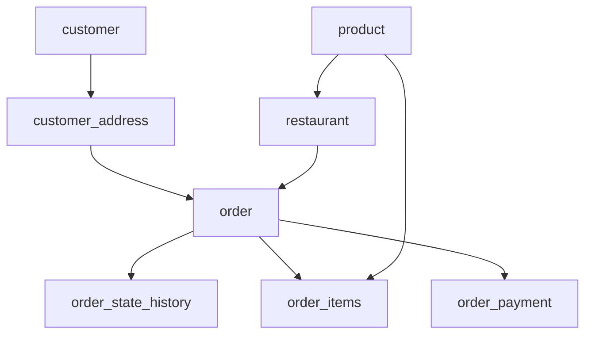

#  <br>Nielsen | Software Developer - Backend (June-2024)

## [Round 1] BarRaiser | On-Site Virtual Coding Round (60 Mins)
### [Coding] Problem Statement 1 - Gas Station

There are `n` gas stations along a circular route, where the amount of gas at the ith station is `gas[i]`.
<br>
You have a car with an unlimited gas tank and it costs `cost[i]` of gas to travel from the `i<sup>th</sup>` station to its next `(i + 1)<sup>th</sup>` station. You begin the journey with an empty tank at one of the gas stations.
<br>
Given two integer arrays `gas` and `cost`, return _the starting gas station's index if you can travel around the circuit once in the clockwise direction, otherwise return_ `-1`. If there exists a solution, it is **guaranteed to be unique**
<br>
 

**Example 1:**

> `Input:` gas = [1,2,3,4,5], cost = [3,4,5,1,2]<br>
> `Output:` 3<br>
> `Explanation:`<br>
> Start at station 3 (index 3) and fill up with 4 unit of gas. Your tank = 0 + 4 = 4<br>
> Travel to station 4. Your tank = 4 - 1 + 5 = 8<br>
> Travel to station 0. Your tank = 8 - 2 + 1 = 7<br>
> Travel to station 1. Your tank = 7 - 3 + 2 = 6<br>
> Travel to station 2. Your tank = 6 - 4 + 3 = 5<br>
> Travel to station 3. The cost is 5. Your gas is just enough to travel back to station 3.<br>
> Therefore, return 3 as the starting index.
<br>

**Example 2:**

> `Input:` gas = [2,3,4], cost = [3,4,3]<br>
> `Output:` -1<br>
> `Explanation:`<br>
> You can't start at station 0 or 1, as there is not enough gas to travel to the next station.<br>
> Let's start at station 2 and fill up with 4 unit of gas. Your tank = 0 + 4 = 4<br>
> Travel to station 0. Your tank = 4 - 3 + 2 = 3<br>
> Travel to station 1. Your tank = 3 - 3 + 3 = 3<br>
> You cannot travel back to station 2, as it requires 4 unit of gas but you only have 3.<br>
> Therefore, you can't travel around the circuit once no matter where you start.<br>

eg:
| input (gas, cost) |   output    |
| :-:   |:-:|
| gas = [1,2,3,4,5], cost = [3,4,5,1,2]|3|
| gas = [2,3,4], cost = [3,4,3]|-1|

#### Solution
<br>Here's how we can implement this in Java:

```java
class Solution {
    public int canCompleteCircuit(int[] gas, int[] cost) {
        int n = gas.length;
        int start = 0; // Starting point index
        int gasCount = 0; // Net gas count from current start

        for (int i = 0; i < n; i++) {
            gasCount += gas[i] - cost[i]; // Calculate net gas at each station
            if (gasCount < 0) {
                start = i + 1; // Reset start to next station
                gasCount = 0; // Reset gasCount
            }
        }

        // Check if the total gas count starting from 'start' is sufficient
        int totalGas = 0;
        int totalCost = 0;
        for (int i = 0; i < n; i++) {
            totalGas += gas[i];
            totalCost += cost[i];
        }

        if (totalGas < totalCost) {
            return -1; // If total gas is less than total cost, return -1
        }

        return start;
    }
}
```

<details>
<summary>More info</summary>
 
 #### Explanation
1. Initialization:
   - `int n = gas.length;`: Determines the number of gas stations.
   - `int start = 0;`: Initially assumes the starting point is at the first gas station.
2. First Loop (Finding a Valid Starting Point):
   - `for (int i = 0; i < n; i++) {` : Iterates through each gas station.
   - `gasCount += gas[i] - cost[i];`: Calculates the net gas available at the current station (`gas[i] - cost[i]`).
   - `if (gasCount < 0) { ... }`: Checks if at any station the net gas count becomes negative.
     - If so, it means starting from the current `start` is not possible because the car would run out of gas before completing the circuit.
     - Therefore, `start` is updated to `i + 1` (next station), and `gasCount` is reset to 0 because starting from the current `start` is not feasible.
3. Second Loop (Verifying Feasibility):
   - Calculates `totalGas` as the sum of all `gas[i]` values across all stations.
   - Calculates `totalCost` as the sum of all `cost[i]` values across all stations.
   - `if (totalGas < totalCost) { return -1; }`: Checks if the total gas available is less than the total cost required to complete the circuit.
     - If true, it means it's impossible to complete the circuit regardless of the starting point, so `-1` is returned.
4. Returning the Result:
   - If the total gas is sufficient (totalGas >= totalCost), start is returned as the index of the starting gas station from which the circuit can be completed.

#### Complexity
- Time complexity:O(n)
- Space complexity:O(1)
</details>

### [Low level Design] Problem Statement 2 - Design a food delivery service

Designing the flow for a food delivery service, including browsing restaurants, adding items to the cart, processing orders, tracking delivery status in real-time, managing payment methods, handling order cancellations, and providing customer support for order issues.

Expectations:
- API Design (Request, Respomse, Method)
- DB Schema Design
- One API code
- Design Patterns

#### Proposed Solution
Entity flow


##### restaurant table

| Column name |   Data type    |
| :-:   |:-:|
| id | Int PRIMARY AUTO INCREMENT|
| address | Varchar |
| lat | Double |
| lng | Double |
| pincode | Int |
| opening_timing | Datetime |
| closing_timing | Datetime |
| day_wise_slot_quotas | TEXT |
| created_at | Datetime |
| created_by | Varchar |
| updated_at | Datetime |
| updated_by | Varchar |

##### product table

| Column name |   Data type    |
| :-:   |:-:|
| id | Int PRIMARY AUTO INCREMENT |
| restaurant_id | Int References([restaurant](#restaurant-table))|
| name | Double |
| price | Double |
| uom | Int |
| price_per_unit | Double |
| product_image | TEXT |
| created_at | Datetime |
| created_by | Varchar |
| updated_at | Datetime |
| updated_by | Varchar |

##### customer table

| Column name |   Data type    |
| :-:   |:-:|
| id | Int PRIMARY AUTO INCREMENT |
| name | varchar |
| contact | long |
| is_active | tinyint(1) OR bit(1) |
| total_order_count| Int |
| created_at | Datetime |
| created_by | Varchar |
| updated_at | Datetime |
| updated_by | Varchar |

##### customer_address table

| Column name |   Data type    |
| :-:   |:-:|
| id | Int PRIMARY AUTO INCREMENT |
| customer_id | Int References([customer](#customer-table))|
| address | varchar |
| lat | Double |
| lng | Double |
| pincode | Int |
| contact | long |
| is_active | tinyint(1) OR bit(1) |
| created_at | Datetime |
| created_by | Varchar |
| updated_at | Datetime |
| updated_by | Varchar |

##### order table

| Column name |   Data type    |
| :-:   |:-:|
| id | Int PRIMARY AUTO INCREMENT |
| customer_address_id | Int References([customer_address](#customer_address-table))|
| restaurant_id | Int References([restaurant](#restaurant-table))|
| state | varchar <br>[As enum in code with values (PROCESSING, ACCEPTED, PACKED, BILLED, DISPATCHED, OUT_FOR_DELIVERY, REACHED_DELIVERY_LOCATION, DELIVERED/CANCELLED/UNDELIVERED)]|
| cancellation_reason_id | Int |
| order_processing_time | Datetime |
| promised_time | Datetime |
| created_at | Datetime |
| created_by | Varchar |
| updated_at | Datetime |
| updated_by | Varchar |

##### order_state_history table

| Column name |   Data type    |
| :-:   |:-:|
| id | Int PRIMARY AUTO INCREMENT |
| order_id | Int References([order](#order-table))|
| state | varchar|
| lat | Double |
| lng | Double |
| created_at | Datetime |
| created_by | Varchar |
| updated_at | Datetime |
| updated_by | Varchar |

##### order_items table

| Column name |   Data type    |
| :-:   |:-:|
| id | Int PRIMARY AUTO INCREMENT |
| order_id | Int References([order](#order-table))|
| product_id | Int References([product](#product-table))|
| quantity | Int |
| packed_weight_per_unit | Double |

##### order_payment table

| Column name |   Data type    |
| :-:   |:-:|
| id | Int PRIMARY AUTO INCREMENT |
| order_id | Int References([order](#order-table))|
| payment_status | tinyint(1) OR bit(1) |
| payment_type | varchar <br>[eg values (Cod, razorpay, paytmpay, amazonpay, etc)]|
| amount_to_be_collected | Double |
| amount_collected | Double |
| settle | tinyint(1) OR bit(1) |

##### Used data On Redis

| Key |   Value    |   Description    |
| :-:   | :-:   | :-:   |
| Restaurant (Sorted Set name) | longitude latitude resturantId (longitude latitude member) | To get restaurants near customer address lat/lng ([for GeoSpacial wise redis inserts & searching](https://redis.io/docs/latest/develop/data-types/geospatial))|
| "ActiveCartByCustomerId"+customerId | cartId | CustomerCartId mapping for storing with TTL expiry (here cartId are temporary Id generated & sent from Frontend)|
| "ActiveCartItemsByCartId"+cartId | cartItems | CustomerCartItems mapping for storing cartItems with TTL expiry (here cartItems are sent from Frontend)|
| "ProductInventoryOnLockByProductId"+productId | unavailable_quantity_on_lock | Resturant Inventory Lock for managing live inventory |

```java
/*
POST placeOrder
Request:
{   cartId:
    paymentInfo:{}
    orderItems:[]
    customerId:
}
*/
Using GlobalExceptionAdvice we will manage exception response handling


@RedisLock(custom annotation for putting lock on concurrent requests in spring boot)
ResponseEntity<RespDto> placeOrder(OrderRequest request) {

        validateRequest(request) // to validate
        lockId = validateAndLockResturantInv(request)
        createOrder(-- Inserts data in Order/Order_items/OrderPayment tables) -> Via JPA entityListener (Insert entry in ORDER_STATE_HISTORY_TABLE) [PUB/SUB]
        releaseLockResturantInvAndDeductInv(request)
        return resp.

}
```
