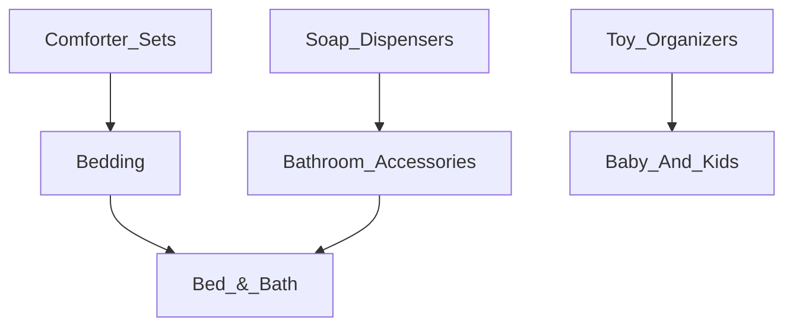

# Interview Experience  Wayfair - Software Engineer II (June-2024)

## [Round 1] Wayfair hackerrank coding Round
### Problem Statement 1 - Task Scheduler

Given an array **taskMemory** of **n** positive integers representing the amount of memory required to process each task, an array **taskType** of **n** positive integers representing the type of each task and an integer **maxMemory**, find the minimum amount of time required for the server to process all the tasks.
<br><br>
>Also each task takes 1 unit of time to process. The server can process at most two tasks in parallel only if they are of the same type and together require no more than **maxMemory** units of memory.
<br>

### Approach
Here's how we can implement this in Java:<br>
1. **Group Tasks by Type**: Group tasks by their type.
2. **Process Each Group**: For each type, attempt to process pairs of tasks in parallel. If a pair exceeds **maxMemory**, process them individually.
3. **Calculate Total Time**: Track the total time required, ensuring tasks are processed optimally given the parallel processing constraints.

<br>The server can process at most two tasks in parallel if they are of the same type and together require no more than maxMemory units of memory, we need to adjust the strategy to take advantage of this parallel processing capability.

```java
import java.util.*;

public class TaskProcessor {
    public static int minTimeToProcessTasks(int[] taskMemory, int[] taskType, int maxMemory) {
        // Step 1: Group tasks by their type
        Map<Integer, List<Integer>> taskGroups = new HashMap<>();
        for (int i = 0; i < taskMemory.length; i++) {
            taskGroups.putIfAbsent(taskType[i], new ArrayList<>());
            taskGroups.get(taskType[i]).add(taskMemory[i]);
        }

        int totalTime = 0;

        // Step 2: Calculate the time required for each group of tasks
        for (Map.Entry<Integer, List<Integer>> entry : taskGroups.entrySet()) {
            List<Integer> memories = entry.getValue();
            Collections.sort(memories); // Sort to try and pair the smallest and largest together
            int i = 0, j = memories.size() - 1;

            while (i <= j) {
                if (i == j) {
                    // Single task remaining
                    totalTime++;
                    i++;
                } else if (memories.get(i) + memories.get(j) <= maxMemory) {
                    // Process two tasks in parallel
                    totalTime++;
                    i++;
                    j--;
                } else {
                    // Process the larger task alone
                    totalTime++;
                    j--;
                }
            }
        }

        return totalTime;
    }

    public static void main(String[] args) {
        int[] taskMemory = {4, 2, 3, 1, 6, 5};
        int[] taskType = {1, 1, 2, 2, 1, 2};
        int maxMemory = 8;

        System.out.println(minTimeToProcessTasks(taskMemory, taskType, maxMemory));  // Output: Expected processing time
    }
}
```
| input |   output    |
| :---:   |:------------------------:|
| taskMemory: [4, 2, 3, 1, 6, 5]<br/>taskType: [1, 1, 2, 2, 1, 2]<br/>maxMemory: 8 |     4      |

### Problem Statement 2 - Location Detection

Implement a prototype service to detect a user's location based on their IP addresses.
<br>
The **IP addresses** belonging to the **IPv4** space are conventionally represented by 4 octets, **"a.b.c.d"** - such as **127.10.20.30**. To keep it simple, these IP addresses are classified into 5 different regions indexed from **1 to 5** on the basis of the order of the bits in the **1st** octet.
<br>
>Broadly, the IP address can be categorized as follows:
>1. 0.0.0.0 - 127.255.255.255.255
>2. 128.0.0.0 - 191.255.255.255.255
>3. 192.0.0.0 - 223.255.255.255.255
>4. 224.0.0.0 - 239.255.255.255.255
>5. 240.0.0.0 - 255.255.255.255.255

Given a list of strings, **ipAddresses**, of size **n**, representing possible **IPv4** addresses, for each address, determine if it is a valid IP or not, and classify it into one of the 5 classes. Return an array of n integers that represent the index of the regions for the corresponding IP addresses.
Represent an invalid IP as **-1**.

```java
import java.util.ArrayList;
import java.util.List;

public class LocationDetection {
  public static void main(String[] args) {
    List<String> ipAddresses = List.of("128.12.34.0", "31.258.90.11");
    List<Integer> results = classifyIPAddresses(ipAddresses);
    System.out.println(results);  // Output: [2, -1]
  }

  public static List<Integer> classifyIPAddresses(List<String> ipAddresses) {
    List<Integer> classifications = new ArrayList<>();

    for (String ipAddress : ipAddresses) {
      if (isValidIP(ipAddress)) {
        int firstOctet = Integer.parseInt(ipAddress.split("\\.")[0]);
        classifications.add(classifyFirstOctet(firstOctet));
      } else {
        classifications.add(-1);
      }
    }

    return classifications;
  }

  private static boolean isValidIP(String ipAddress) {
    String[] octets = ipAddress.split("\\.");
    if (octets.length != 4) {
      return false;
    }

    for (String octet : octets) {
      try {
        int value = Integer.parseInt(octet);
        if (value < 0 || value > 255) {
          return false;
        }
      } catch (NumberFormatException e) {
        return false;
      }
    }

    return true;
  }

  private static int classifyFirstOctet(int firstOctet) {
    if (firstOctet >= 0 && firstOctet <= 127) {
      return 1;
    } else if (firstOctet >= 128 && firstOctet <= 191) {
      return 2;
    } else if (firstOctet >= 192 && firstOctet <= 223) {
      return 3;
    } else if (firstOctet >= 224 && firstOctet <= 239) {
      return 4;
    } else if (firstOctet >= 240 && firstOctet <= 255) {
      return 5;
    } else {
      return -1;
    }
  }
}
```
|             input(ipAddresses)             | output(classification) |
|:------------------------------------------:|:----------------------:|
|      ["128.12.34.0", "31.258.90.11"]       |        [2, -1]         |

##
## [Round 2] Wayfair OnSite Virtual coding Round

### Problem Statement
Given the following set of data sets, create a function that will find the coupon to display for a given category.
```java
    // {{CategoryName, CouponName}}
    String [][] coupons = {
        {"Comforter Sets", "Comforters Sale"},
        {"Bedding", "Savings on Bedding"},
        {"Bed & Bath", "Low price for Bed & Bath"}
    };
    
    // {{CategoryName, CategoryParentName}}
    String [][] categories = {
        {"Comforter Sets", "Bedding"},
        {"Bedding", "Bed & Bath"},
        {"Bed & Bath", null},
        {"Soap Dispensers", "Bathroom Accessories"},
        {"Bathroom Accessories", "Bed & Bath"},
        {"Toy Organizers", "Baby And Kids"},
        {"Baby And Kids", null}
    };
   ```

| input (CategoryName) |   output (CouponName)    |
| :---:   |:------------------------:|
| Comforter Sets |     Comforters Sale      |
| Bedding |    Savings on Bedding    |
| Bathroom Accessories | Low price for Bed & Bath |
| Soap Dispensers | Low price for Bed & Bath |
| Toy Organizers |           null           |

### Requirements/Acceptance Criteria
- Create a function that when passed a Category Name (as a String) will return Coupon Name (as a String)
- Category structure is hierarchical. Categories without coupons inherit their parent's coupon.
- No coupon should be returned if there are no coupons in the Category's hierarchy
  - For example: Toy Organizers receives no coupon because there is no coupon in the category hierarchy.
- If a Category has a coupon it should not move up the hierarchy to find its Parent Category (or the Parent's Coupon)
  - For example: Comforter sets, should see the coupon for Comforter Sets and NOT Bedding
- Beware of the following examples/edge cases and their expected behaviors:
  - Bathroom Accessories should receive the coupon for Bed & Bath because there are no coupons for Bathroom Accessories
- Assumption: Product can only be associated with one category.

### Solution

```java
import java.util.*;

public class CategoryAndCoupons {
private final Map<String, String> couponsCategoryMap;
private final Map<String, String> parentCategoryMap;

    CategoryAndCoupons(String [][] coupons, String [][] categories) {
        this.couponsCategoryMap = new HashMap<>();
        this.parentCategoryMap = new HashMap<>();
        for (String[] coupon : coupons) this.couponsCategoryMap.put(coupon[0], coupon[1]);
        for (String[] category : categories) this.parentCategoryMap.put(category[0], category[1]);
    }

    private String getCoupon(String categoryName) {
        if(this.couponsCategoryMap.containsKey(categoryName))
            return this.couponsCategoryMap.get(categoryName);
        if(Objects.isNull(this.parentCategoryMap.get(categoryName)))
            return null;
        return getCoupon(this.parentCategoryMap.get(categoryName));
    }

    public static void main(String[] args) {
        String [][] coupons = {
                {"Comforter Sets", "Comforter Sale"},
                {"Bedding", "Savings on Bedding"},
                {"Bed & Bath", "Low price for Bed & Bath"}
        };
        // Bed & Bath > Bedding > Comforter Sets
        // Bed & Bath > Bathroom Accessories > Soap Dispensers
        // Baby And Kids > Toy Organizers
        String [][] categories = {
                {"Comforter Sets", "Bedding"},
                {"Bedding", "Bed & Bath"},
                {"Bed & Bath", null},
                {"Soap Dispensers", "Bathroom Accessories"},
                {"Bathroom Accessories", "Bed & Bath"},
                {"Toy Organizers", "Baby And Kids"},
                {"Baby And Kids", null}
        };
        CategoryAndCoupons categoryAndCoupons = new CategoryAndCoupons(coupons, categories);
        System.out.println("Comforter Sets => " + categoryAndCoupons.getCoupon("Comforter Sets"));
        System.out.println("Bedding => " + categoryAndCoupons.getCoupon("Bedding"));
        System.out.println("Bathroom Accessories => " + categoryAndCoupons.getCoupon("Bathroom Accessories"));
        System.out.println("Soap Dispensers => " + categoryAndCoupons.getCoupon("Soap Dispensers"));
        System.out.println("Toy Organizers => " + categoryAndCoupons.getCoupon("Toy Organizers"));
    }
}
```
### Problem Statement (Follow up 1)
The system has added a new piece of data to the coupon - "Date Modified". Use this when resolving any ties (when 1 Category
has 2+ Coupons).
```java
    // {{CategoryName, CouponName, DateModified}}
    String [][] coupons = {
            {"Comforter Sets", "Comforter Sale", "2020-01-01"},
            {"Comforter Sets", "Cozy Comforter Coupon", "2020-01-01"},
            {"Bedding", "Best Bedding Bargains", "2019-01-01"},
            {"Bedding", "Savings on Bedding", "2019-01-01"},
            {"Bed & Bath", "Low price for Bed & Bath", "2018-01-01"},
            {"Bed & Bath", "Bed & Bath extravaganza", "2019-01-01"},
            {"Bed & Bath", "Big Savings for Bed & Bath", "2030-01-01"}
    };
    
    // {{CategoryName, CategoryParentName}}
    String [][] categories = {
        {"Comforter Sets", "Bedding"},
        {"Bedding", "Bed & Bath"},
        {"Bed & Bath", null},
        {"Soap Dispensers", "Bathroom Accessories"},
        {"Bathroom Accessories", "Bed & Bath"},
        {"Toy Organizers", "Baby And Kids"},
        {"Baby And Kids", null}
    };
   ```

| input (CategoryName) |             output (CouponName)             |
| :---:   |:-------------------------------------------:|
| Bed & Bath |           Bed & Bath extravaganza           |
| Bedding | Best Bedding Bargains \| Savings on Bedding |
| Bathroom Accessories |           Bed & Bath extravaganza           |
| Comforter Sets |   Comforter Sale \| Cozy Comforter Coupon   |

### Requirements/Acceptance Criteria
- Create a function that when passed a Category Name (as a String) will return one Coupon Name (as a String)
- If a Category has more than 1 coupon the Coupon with the most recent DateModified should be returned
- If a Coupon's DateModified is in the future, it should not be returned
- Category structure is hierarchical. Categories without coupons inherit their parent's coupon.

### Additional Guidance
- Use of the internet for syntax and basic implementation questions is allowed.
- Think out loud! Describe your approach and discuss changes as new information surfaces

### Solution

```java
import lombok.Getter;
import lombok.Setter;
import lombok.ToString;

import java.time.LocalDate;
import java.time.format.DateTimeFormatter;
import java.util.*;
import java.util.stream.Collectors;

public class CategoryAndCouponsF1 {
    private final String datePattern = "yyyy-MM-dd";
    private final DateTimeFormatter FORMATTER = DateTimeFormatter.ofPattern(datePattern);

    @Setter
    @Getter
    @ToString
    static class Coupon {
        private String couponName;
        private LocalDate dateModified;
        public Coupon (String couponName, LocalDate dateModified) {
            this.couponName = couponName;
            this.dateModified = dateModified;
        }
    }

    private final Map<String, Map<LocalDate, List<Coupon>>> categoryCouponsMapGroupByModifiedDate;
    private final Map<String, String> parentCategoryMap;

    CategoryAndCouponsF1(String [][] coupons, String [][] categories) {
        Map<String, List<Coupon>> couponsCategoryMap = new HashMap<>();
        this.parentCategoryMap = new HashMap<>();
        this.categoryCouponsMapGroupByModifiedDate = new HashMap<>();
        for (String[] coupon : coupons) {
            if(!couponsCategoryMap.containsKey((coupon[0])))
                couponsCategoryMap.put(coupon[0], new ArrayList<>());

            LocalDate dateModified = LocalDate.parse(coupon[2], FORMATTER);
            if(dateModified.isBefore(LocalDate.now()))
                couponsCategoryMap.get(coupon[0]).add(new Coupon(coupon[1], dateModified));
        }
        for (String[] category : categories) this.parentCategoryMap.put(category[0], category[1]);
        for (Map.Entry<String, List<Coupon>> couponsEntry : couponsCategoryMap.entrySet()) {
            this.categoryCouponsMapGroupByModifiedDate.put(couponsEntry.getKey(), couponsEntry.getValue().stream().collect(Collectors.groupingBy(Coupon::getDateModified)));
        }
    }

    private String getCoupon(String categoryName) {
        if(this.categoryCouponsMapGroupByModifiedDate.containsKey(categoryName)
                && this.categoryCouponsMapGroupByModifiedDate.get(categoryName).values().stream().findFirst().isPresent())
            return this.categoryCouponsMapGroupByModifiedDate.get(categoryName).values().stream().findFirst().get().stream().map(Coupon::getCouponName).collect(Collectors.joining(" | "));
        if(Objects.isNull(this.parentCategoryMap.get(categoryName)))
            return null;
        return getCoupon(this.parentCategoryMap.get(categoryName));
    }

    public static void main(String[] args) {
        String [][] coupons = {
                {"Comforter Sets", "Comforter Sale", "2020-01-01"},
                {"Comforter Sets", "Cozy Comforter Coupon", "2020-01-01"},
                {"Bedding", "Best Bedding Bargains", "2019-01-01"},
                {"Bedding", "Savings on Bedding", "2019-01-01"},
                {"Bed & Bath", "Low price for Bed & Bath", "2018-01-01"},
                {"Bed & Bath", "Bed & Bath extravaganza", "2019-01-01"},
                {"Bed & Bath", "Big Savings for Bed & Bath", "2030-01-01"}
        };
        // Bed & Bath > Bedding > Comforter Sets
        // Bed & Bath > Bathroom Accessories > Soap Dispensers
        // Baby And Kids > Toy Organizers
        String [][] categories = {
                {"Comforter Sets", "Bedding"},
                {"Bedding", "Bed & Bath"},
                {"Bed & Bath", null},
                {"Soap Dispensers", "Bathroom Accessories"},
                {"Bathroom Accessories", "Bed & Bath"},
                {"Toy Organizers", "Baby And Kids"},
                {"Baby And Kids", null}
        };
        CategoryAndCouponsF1 categoryAndCoupons = new CategoryAndCouponsF1(coupons, categories);

        System.out.println("Bed & Bath => " + categoryAndCoupons.getCoupon("Bed & Bath"));
        System.out.println("Bedding => " + categoryAndCoupons.getCoupon("Bedding"));
        System.out.println("Bathroom Accessories => " + categoryAndCoupons.getCoupon("Bathroom Accessories"));
        System.out.println("Comforter Sets => " + categoryAndCoupons.getCoupon("Comforter Sets"));
    }
}
```
### Problem Statement (Follow up 2)
Now that we know what coupon to show to the user, let's make sure the user can apply the coupon by changing the selling price
of a Product.<br>
>**_Format (Category Name, Coupon Name, Date Modified, Discount)_**
```java
    // {{CategoryName, CouponName, DateModified, Discount}}
String [][] coupons = {
        {"Comforter Sets", "Comforters Sale", "2020-01-01", "10%"},
        {"Comforter Sets", "Cozy Comforter Coupon", "2020-01-01", "$15"},
        {"Bedding", "Best Bedding Bargains", "2019-01-01", "35%"},
        {"Bedding", "Savings on Bedding", "2019-01-01", "25%"},
        {"Bed & Bath", "Low price for Bed & Bath", "2018-01-01", "50%"},
        {"Bed & Bath", "Bed & Bath extravaganza", "2019-01-01", "75%"}
};

// {{CategoryName, CategoryParentName}}
String [][] categories = {
        {"Comforter Sets", "Bedding"},
        {"Bedding", "Bed & Bath"},
        {"Bed & Bath", null},
        {"Soap Dispensers", "Bathroom Accessories"},
        {"Bathroom Accessories", "Bed & Bath"},
        {"Toy Organizers", "Baby And Kids"},
        {"Baby And Kids", null}
};

// {{ProductName, Price, CategoryName}}
String [][] products = {
        {"Cozy Comforter Sets", "100.00", "Comforter Sets"},
        {"All-in-one Bedding Set", "50.00", "Bedding"},
        {"Infinite Soap Dispenser", "500.00", "Bathroom Accessories"},
        {"Rainbow Toy Box", "257.00", "Baby And Kids"}
};
   ```

| input (ProductName) |           output (Discount)           |
| :---:   |:---------------------------------------:|
| Cozy Comforter Sets |90.0 OR 85.0|
| All-in-one Bedding Set |32.5 OR 37.5|
| Infinite Soap Dispenser |125.0|
| Rainbow Toy Box |257.0|

### Requirements/Acceptance Criteria
- Function takes a String representing the Product Name
- Function Returns the discounted price (Product price minus the coupon discount) as a String

### Solution

```java
import lombok.Getter;
import lombok.Setter;
import lombok.ToString;

import java.time.LocalDate;
import java.time.format.DateTimeFormatter;
import java.util.*;
import java.util.stream.Collectors;

//https://leetcode.com/discuss/interview-question/4491846/Wayfair-or-SDE2-L2-4-Onsite-Virtual-or-Coupon-category/
//https://leetcode.com/discuss/interview-question/4799068/Wayfair-or-Onsite-or-Round-1-DSA-or-Bangalore/

public class CategoryAndCouponsF2 {
  private final String datePattern = "yyyy-MM-dd";
  private final DateTimeFormatter FORMATTER = DateTimeFormatter.ofPattern(datePattern);

  @Setter
  @Getter
  @ToString
  static class Coupon {
    private String couponName;
    private LocalDate dateModified;
    private String discount;
    public Coupon(String couponName, LocalDate dateModified, String discount) {
      this.couponName = couponName;
      this.dateModified = dateModified;
      this.discount = discount;
    }
  }

  @Setter
  @Getter
  @ToString
  static class Product {
    private String name;
    private String categoryName;
    private Double price;
    public Product(String categoryName, String name, Double price) {
      this.categoryName = categoryName;
      this.name = name;
      this.price = price;
    }
  }
  private final Map<String, String> couponsDiscountMap;
  private final Map<String, String> parentCategoryMap;
  private final Map<String, Product> productCategoryMap;
  private final Map<String, Map<LocalDate, List<CategoryAndCouponsF2.Coupon>>> categoryCouponsMapGroupByModifiedDate;

  CategoryAndCouponsF2(String [][] coupons, String [][] categories, String [][] products) {
    Map<String, List<Coupon>> couponsCategoryMap = new HashMap<>();
    this.parentCategoryMap = new HashMap<>();
    this.productCategoryMap = new HashMap<>();
    this.couponsDiscountMap = new HashMap<>();
    this.categoryCouponsMapGroupByModifiedDate = new HashMap<>();
    for (String[] coupon : coupons) {
      if(!couponsCategoryMap.containsKey((coupon[0])))
        couponsCategoryMap.put(coupon[0], new ArrayList<>());

      LocalDate dateModified = LocalDate.parse(coupon[2], FORMATTER);

      if(dateModified.isBefore(LocalDate.now()))
        couponsCategoryMap.get(coupon[0]).add(new Coupon(coupon[1], dateModified, coupon[3]));

      couponsDiscountMap.put(coupon[1], coupon[3]);
    }
    for (String[] category : categories) this.parentCategoryMap.put(category[0], category[1]);
    for (Map.Entry<String, List<CategoryAndCouponsF2.Coupon>> couponsEntry : couponsCategoryMap.entrySet())
      this.categoryCouponsMapGroupByModifiedDate.put(couponsEntry.getKey(), couponsEntry.getValue().stream().collect(Collectors.groupingBy(CategoryAndCouponsF2.Coupon::getDateModified)));
    for (String[] product : products) this.productCategoryMap.put(product[0], new Product(product[2], product[0], Double.parseDouble(product[1])));
  }

  private Set<String> getCoupon(String categoryName) {
    if(this.categoryCouponsMapGroupByModifiedDate.containsKey(categoryName)
            && this.categoryCouponsMapGroupByModifiedDate.get(categoryName).values().stream().findFirst().isPresent())
      return this.categoryCouponsMapGroupByModifiedDate.get(categoryName).values().stream().findFirst().get().stream().map(CategoryAndCouponsF2.Coupon::getCouponName).collect(Collectors.toSet());
    if(Objects.isNull(this.parentCategoryMap.get(categoryName)))
      return null;
    return getCoupon(this.parentCategoryMap.get(categoryName));
  }

  private  String displayDiscountPrice(String productName) {
    Product product = this.productCategoryMap.get(productName);
    Set<String> coupon = getCoupon(product.getCategoryName());
    if(Objects.isNull(coupon))
      return product.getPrice().toString();
    return String.join(" OR ", coupon.stream()
            .map(s -> applyDiscount(product.getPrice(), this.couponsDiscountMap.get(s.trim())).toString())
            .collect(Collectors.toSet())
    );
  }

  private Double applyDiscount(Double originalPrice, String discount) {
    double discountAmount;
    if(discount.contains("$"))
      discountAmount = Double.parseDouble(discount.replaceAll("\\$", ""));
    else
      discountAmount = originalPrice * (Double.parseDouble(discount.replaceAll("%", "")) / 100);
    return originalPrice - discountAmount;
  }

  public static void main(String[] args) {
    String [][] coupons = {
            {"Comforter Sets", "Comforters Sale", "2020-01-01", "10%"},
            {"Comforter Sets", "Cozy Comforter Coupon", "2020-01-01", "$15"},
            {"Bedding", "Best Bedding Bargains", "2019-01-01", "35%"},
            {"Bedding", "Savings on Bedding", "2019-01-01", "25%"},
            {"Bed & Bath", "Low price for Bed & Bath", "2018-01-01", "50%"},
            {"Bed & Bath", "Bed & Bath extravaganza", "2019-01-01", "75%"}
    };
    // Bed & Bath > Bedding > Comforter Sets
    // Bed & Bath > Bathroom Accessories > Soap Dispensers
    // Baby And Kids > Toy Organizers
    String [][] categories = {
            {"Comforter Sets", "Bedding"},
            {"Bedding", "Bed & Bath"},
            {"Bed & Bath", null},
            {"Soap Dispensers", "Bathroom Accessories"},
            {"Bathroom Accessories", "Bed & Bath"},
            {"Toy Organizers", "Baby And Kids"},
            {"Baby And Kids", null}
    };

    String [][] products = {
            {"Cozy Comforter Sets", "100.00", "Comforter Sets"},
            {"All-in-one Bedding Set", "50.00", "Bedding"},
            {"Infinite Soap Dispenser", "500.00", "Bathroom Accessories"},
            {"Rainbow Toy Box", "257.00", "Baby And Kids"}
    };

    CategoryAndCouponsF2 cc = new CategoryAndCouponsF2(coupons, categories, products);

    System.out.println("Cozy Comforter Sets => " + cc.displayDiscountPrice("Cozy Comforter Sets"));
    System.out.println("All-in-one Bedding Set => " + cc.displayDiscountPrice("All-in-one Bedding Set"));
    System.out.println("Infinite Soap Dispenser => " + cc.displayDiscountPrice("Infinite Soap Dispenser"));
    System.out.println("Rainbow Toy Box => " + cc.displayDiscountPrice("Rainbow Toy Box"));
  }
}
```
